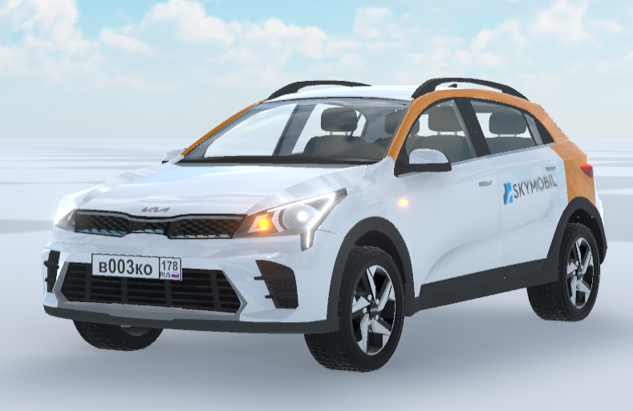
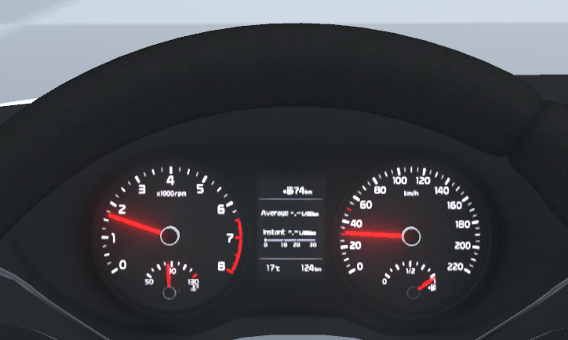

# Car driving simulator

Implementation of an interactive simulation with the cars of a short-term car rental service.

Car rental and management of their status will be possible through other applications of the service.

# Car physics

The application implements some features of the physics of driving a car. For example, a simulation of an engine and an automatic transmission that shifts gears to optimize rpm and torque delivered to the wheels.

